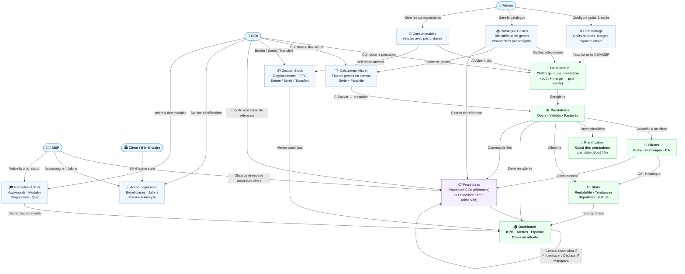
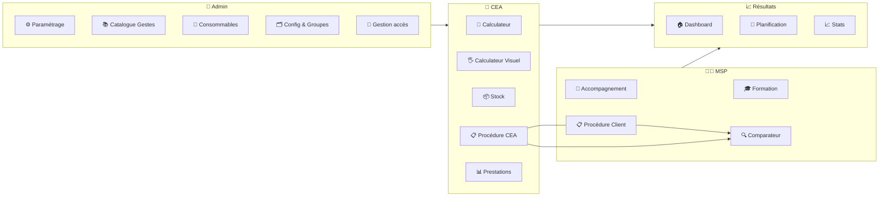

# Documentation — Outil Complet Atelier - La Pallanterie

> **Chiffrage Financier • Gestion de Stock • Valorisation FIFO • Prestations**

---

## Sommaire

1. [Présentation générale](#1-présentation-générale)
   - [Flux global des activités](#11-flux-global-des-activités)
   - [Vue par acteur](#12-vue-par-acteur)
2. [Démarrage rapide](#2-démarrage-rapide)
3. [Structure du projet](#3-structure-du-projet)
4. [Modules fonctionnels](#4-modules-fonctionnels)
   - [Tableau de bord](#41-tableau-de-bord-)
   - [Assistant](#42-assistant-)
   - [Calculateur](#43-calculateur-)
   - [Gestion de stock](#44-gestion-de-stock-)
   - [Paramétrage](#45-paramétrage-)
   - [Catalogue des gestes](#46-catalogue-des-gestes-)
   - [Consommables](#47-consommables-)
   - [Prestations](#48-prestations-)
   - [Clients](#49-clients-)
   - [Statistiques](#410-statistiques-)
   - [Configuration](#411-configuration-)
   - [Accompagnement](#412-accompagnement-)
   - [Historique](#413-historique-)
   - [Planification](#414-planification-)
   - [Formation Admin](#415-formation-admin-)
   - [Formation Logistique](#416-formation-logistique-)
   - [Calculateur visuel](#417-calculateur-visuel-)
5. [Calculs et méthodes financières](#5-calculs-et-méthodes-financières)
6. [Import / Export de données](#6-import--export-de-données)
7. [Raccourcis clavier](#7-raccourcis-clavier)
8. [Modes d'affichage](#8-modes-daffichage)
9. [Gestion des accès et profils](#9-gestion-des-accès-et-profils)
10. [Données et persistance](#10-données-et-persistance)
11. [Technologies utilisées](#11-technologies-utilisées)
12. [Glossaire](#12-glossaire)
13. [Authentification et Permissions (Phase 2)](#13-phase-2--authentification-et-permissions)
14. [Email Webhooks (Phase 3)](#14-phase-3--email-webhooks)
15. [Système de Formation (Phase 1)](#15-système-de-formation-phase-1)
16. [Conditions d'utilisation](#16-conditions-dutilisation)
17. [✨ Confort & raccourcis UX *(Avril 2026)*](#17--confort--raccourcis-ux-avril-2026)

---

## 1. Présentation générale

**Outil Complet Atelier - La Pallanterie** est une application web monopage (SPA) autonome conçue pour la gestion financière et opérationnelle d'un atelier de travail adapté.

L'outil permet de :
- **Chiffrer** des prestations de services (coût de revient, prix de vente, marges)
- **Gérer les stocks** avec valorisation FIFO automatique

### 1.1 Flux global des activités



### 1.2 Vue par acteur




- **Suivre les clients** et leur historique de prestations
- **Planifier** les prestations via un diagramme de Gantt
- **Analyser** la rentabilité et les performances via des tableaux de bord

L'application fonctionne entièrement **hors ligne** dans le navigateur, sans serveur, sans installation. Toutes les données sont stockées localement via le `localStorage` du navigateur.

---

## 2. Démarrage rapide

### Installation

Aucune installation requise. Ouvrez simplement le fichier `index.html` dans un navigateur moderne (Chrome, Firefox, Edge).

```
Ouvrir index.html dans votre navigateur
```

### Premier lancement

1. Accédez à l'onglet **Paramétrage** pour configurer :
   - Le coût horaire des CEA (travailleurs)
   - Le coût horaire des MSP (encadrants)
   - Les frais généraux et le taux de marge par défaut
2. Importez votre catalogue de gestes via l'onglet **Gestes** (fichier CSV fourni)
3. Créez votre première prestation dans le **Calculateur**

### Sauvegarde initiale

Dès que des données sont saisies, effectuez une sauvegarde depuis l'onglet **Configuration → Export JSON** afin de conserver un point de restauration.

---

## 3. Structure du projet

```
outil_chiffrage_atelier_1er/
├── index.html                    # Application complète (HTML + CSS + JavaScript)
├── catalogue_gestes_import.csv   # Modèle CSV pour l'import de gestes
├── README.md                     # Ce fichier
└── RELEASE_v2.0.0.md             # Notes de version 2.0.0
```

L'application est intentionnellement contenue dans un **seul fichier HTML** pour garantir :
- Un déploiement sans étape de compilation
- Un fonctionnement 100 % hors ligne
- L'absence de dépendances serveur
- La confidentialité totale des données (rien ne quitte l'appareil)

---

## 4. Modules fonctionnels

L'interface est organisée en **17 onglets** accessibles via la barre de navigation en haut de page. Selon le profil actif, certains onglets peuvent être masqués. En mode administrateur, les onglets sont réorganisables par glisser-déposer.

---

### 4.1 Tableau de bord 🏠

Vue d'ensemble de l'activité de l'atelier.

**KPIs principaux :**
- Prestations totales, CA du mois, devis en attente, heures engagées, taux d'occupation CEA

**Visualisations :**
- Devis en attente avec ancienneté et alertes (> 7 jours, > 30 jours)
- Pipeline de chiffre d'affaires sur 3 mois (confirmé vs potentiel)
- Top clients par CA sur 12 mois
- Évolution CA sur 12 mois (graphique barres + moyenne mensuelle)
- Top prestations par rentabilité (marge %)
- Répartition par statut (devis/soumis/validé/facturé/annulé)
- Tendance marge moyenne sur 6 mois (courbe + indicateur)

**Alertes :**
- Stock bas, devis expirés, capacité dépassée
- Demandes de formation en attente (avec boutons accepter/refuser)

---

### 4.2 Assistant 🧙

*(Accès administrateur)*

Outil pédagogique de guidage à la création de prestations.

**Fonctionnalités :**
- Assistant pas-à-pas pour construire une prestation
- Modèles de services pré-configurés
- Analyse de situations et recommandations théoriques
- Support à la formation des encadrants

---

### 4.3 Calculateur 💼

**Module central de chiffrage.** Permet de construire, calculer et exporter une prestation.

#### Informations de la prestation

| Champ | Description |
|-------|-------------|
| Client | Nom ou référence du client |
| Intitulé | Nom de la prestation |
| Référence | Code ou numéro de référence |
| Date | Date prévue ou de création |
| Responsable | Encadrant ou gestionnaire |

#### Personnel

- **CEA** : nombre de travailleurs (Collaborateur en Emploi Adapté)
- **MSP** : nombre d'encadrants (Maître SocioProfessionnel)

#### Gestion des gestes

Les **gestes** sont les étapes élémentaires de la prestation (ex. : réception, contrôle qualité, emballage…).

**Actions disponibles :**
- Ajouter un geste depuis le catalogue ou en créer un à la volée
- Saisir la durée (en minutes) et la quantité par pièce
- Réorganiser par glisser-déposer
- Ajouter aux favoris
- Annuler/refaire (Ctrl+Z)
- Utiliser les **bundles** (raccourcis de combinaisons de gestes prédéfinis)
- Utiliser le **chronomètre** intégré pour mesurer le temps réel

#### Consommables

Ajout de matières et fournitures avec leurs coûts unitaires et quantités.

#### Période de stockage

Calcul automatique des coûts de stockage selon le nombre de jours et le taux journalier configuré.

#### Temps administratif

Temps supplémentaire pour les tâches administratives liées à la prestation.

#### Valorisation financière

Récapitulatif complet :
- Coût main-d'œuvre (CEA + MSP)
- Coût des consommables
- Frais de stockage
- Frais généraux
- **Coût de revient total**
- Marge appliquée
- **Prix de vente calculé**

#### Simulation de volumes

Calcul automatique du coût unitaire pour différents volumes : 100, 250, 500, 1 000 et 2 500 unités.

#### Export PDF

Génération d'un devis en PDF compact (optimisé pour tenir sur une seule page A4) en version client ou version interne avec coûts détaillés.

---

### 4.4 Gestion de stock 📦

Suivi des entrées, sorties et transferts de stock avec valorisation automatique.

#### Configuration du stock

- Ratios palette/rack
- Unités de mesure
- Emplacements de stockage

#### Mouvements de stock

Chaque mouvement enregistre :
- Type (entrée, sortie, transfert, inventaire)
- Article et quantité
- Emplacement source/destination
- Date et responsable
- Coût unitaire (pour les entrées)

Le formulaire s'adapte selon le type sélectionné :
- **Entrée** : référence libre, emplacement, prix unitaire
- **Sortie** : liste déroulante des articles **existants en stock** (avec quantité disponible)
- **Transfert** : article existant + emplacement source + emplacement **destination** — les lots sont déplacés en FIFO sans modifier le total

#### Stock actuel

Tableau en temps réel de l'ensemble des articles avec :
- Quantité disponible
- Valeur FIFO
- Seuil d'alerte minimum
- Emplacement

#### Valorisation FIFO

La méthode **FIFO** (First In, First Out — Premier Entré, Premier Sorti) est appliquée automatiquement pour valoriser les sorties de stock au coût des lots les plus anciens.

#### Alertes de stock

Notifications automatiques lorsqu'un article passe en dessous de son seuil minimum défini.

#### Stocks minimums & alertes

Tableau interactif permettant de définir un **stock minimum** par référence article :
- Colonne **Stock min** : champ éditable pour chaque article
- **Statut** : badge "✅ OK" ou "⚠️ Stock bas" automatique
- **Export CSV** : export de l'inventaire complet avec alertes

#### Modèles de stock minimum

Fonctionnalité de sauvegarde et chargement de configurations de stock minimum :
- **💾 Sauver comme modèle** : sauvegarde la configuration actuelle avec un nom personnalisé
- **📂 Charger modèle** : liste des modèles sauvegardés, application en un clic
- **Suppression** : possibilité de supprimer les modèles obsolètes
- Les modèles sont persistés dans le `localStorage`

---

### 4.5 Paramétrage ⚙️

Configuration des paramètres financiers globaux.

| Paramètre | Description |
|-----------|-------------|
| Coût horaire CEA | Taux horaire chargé d'un travailleur |
| Coût horaire MSP | Taux horaire chargé d'un encadrant |
| Frais généraux | Charges fixes (loyer, fluides…) |
| Taux de marge par défaut | Pourcentage de marge commerciale |

**Paramètres administrateur :**
- **Profils d'onglets** : définir quels onglets sont visibles selon le rôle
- **Types de mouvements** : configurer les catégories de mouvements de stock
- **Emplacements** : gérer les zones de stockage
- **Unités** : créer ou modifier les unités de mesure

---

### 4.6 Catalogue des gestes 📚

Bibliothèque de toutes les activités élémentaires de l'atelier.

**Chaque geste contient :**
- Code unique (ex. : `REC-01`, `CTR-02`)
- Catégorie (Réception, Contrôle, Étiquetage, Assemblage, Préparation, Stockage, Expédition)
- Description
- Durée standard (en minutes)
- Coefficient multiplicateur (de 1,0 à 1,5 selon la complexité)
- Notes complémentaires

**Le fichier `catalogue_gestes_import.csv`** contient 43 gestes pré-définis prêts à l'import.

**Panneau Modèle / Import / Export (3 colonnes) :**
| Panneau | Action |
|---------|--------|
| 📋 Modèle | Télécharge un fichier CSV d'exemple (`modele_gestes.csv`) |
| 📥 Import | Zone drag-and-drop ou clic pour importer un CSV |
| 📤 Export | Exporte le catalogue complet au format CSV |

Format CSV : `code,categorie,description,temps,coef,notes`

---

### 4.7 Consommables 🛒

Catalogue des matières et fournitures utilisées dans les prestations.

- Ajouter des articles avec désignation, coût unitaire et unité
- Réutiliser directement depuis le Calculateur et le Calculateur visuel

**Panneau Modèle / Import / Export (3 colonnes) :**
| Panneau | Action |
|---------|--------|
| 📋 Modèle | Télécharge un fichier CSV d'exemple (`modele_consommables.csv`) |
| 📥 Import | Import CSV — colonnes : `nom,unite,prix,designation` |
| 📤 Export | Exporte la liste complète des consommables au format CSV |

---

### 4.8 Prestations 📊

Historique et suivi de toutes les prestations enregistrées.

**Fonctionnalités :**
- Visualiser toutes les prestations avec filtres (date, statut, client)
- Modifier une prestation existante
- Dupliquer pour créer une variante
- Suivre les révisions successives
- Visualiser le coût en temps réel

**Statuts disponibles :**
- Brouillon
- Soumis
- Devis envoyé
- Accepté
- En cours
- Terminé
- Annulé

---

### 4.9 Clients 👥

Gestion du portefeuille clients.

**Fiche client :**
- Coordonnées (téléphone, email, adresse)
- Tarifs personnalisés (remises ou majorations spécifiques)
- Conditions de paiement
- Historique des prestations réalisées
- Export de la fiche client en PDF

---

### 4.10 Statistiques 📈

Tableaux de bord analytiques pour piloter l'activité.

**Analyses disponibles :**
- Synthèse globale (CA, coûts, marges)
- Répartition des coûts
- Bilan de gestion des stocks
- Évolution CA et coûts sur 6 mois
- Top 5 des prestations les plus rentables
- Tableau de bord capacitaire (taux d'occupation CEA/MSP, noms des prestations dans les barres de charge)
- Précision des estimations vs réalisé
- Objectifs mensuels de CA
- Prévisions sur 3 mois
- Rentabilité par geste
- Statistiques de stock mensuelles

---

### 4.11 Configuration ⚙️

Paramètres de l'application et gestion des données.

#### Gestion des données

| Action | Description |
|--------|-------------|
| Export JSON | Sauvegarde complète de toutes les données |
| Import JSON | Restauration depuis une sauvegarde |

**Il est fortement recommandé d'effectuer des exports réguliers.**

#### Apparence

- **Thèmes** : classique, sombre, couleurs personnalisées
- **Police** : choix de la typographie (Inter, Roboto, system-ui… via Google Fonts)
- **Rayon des coins** : personnalisation de l'arrondi des éléments (CSS variables `--border-radius-*`)
- **Densité** : compact, normal, spacieux
- **Séparation des onglets** : bordure visuelle entre chaque onglet

#### Sécurité

- **Code PIN** : protéger l'accès à l'application

#### Préférences d'affichage

- Mode de calcul
- Vue détaillée ou résumée
- Préférences d'impression (version client / interne)

---

### 4.12 Accompagnement 🧠

*(Accès administrateur)*

Ressources pédagogiques pour les encadrants.

- Études de cas cliniques interactives
- Cadres théoriques recommandés avec liens vers Cairn.info
- Supports de formation

---

### 4.13 Historique 📝

*(Accès administrateur)*

Traçabilité complète des modifications apportées aux prestations.

- Toutes les versions successives d'une prestation
- Comparaison entre révisions
- Audit trail des changements

---

### 4.14 Planification 📅

Diagramme de Gantt pour la planification des prestations.

**Fonctionnalités :**
- Visualisation en mode mois ou semaine
- Affectation de dates aux prestations
- Codage couleur par projet/client
- Navigation temporelle
- Duplication de blocs
- Vue multi-projets simultanée

---

### 4.15 Formation Admin 🎓

Gestion des apprenants et suivi de la progression des formations.

**Fonctionnalités :**
- Ajouter et gérer des apprenants
- Assigner des formations par domaine (logistique, gestes, etc.)
- Checklist de progression par apprenant (gestes maîtrisés / en cours)
- Vidéos de formation intégrées par geste
- Fiche formation imprimable par apprenant
- Export et import des rapports de formation

---

### 4.16 Formation Logistique 🏭

Module pédagogique dédié à la découverte des systèmes logistiques et technologies utilisés en industrie.

**Contenu éducatif :**
- Fiches descriptives des systèmes clés : WMS, ERP, TMS, Automatisation (Convoyeurs & AGV), RFID & Traçabilité, FIFO/FEFO/LIFO, Kanban & Lean, 5S
- Concepts clés à retenir : Supply Chain, KPI Logistique, Flux Tendu, Traçabilité
- Cas d'études réels (Amazon, Decathlon…)

**Quiz interactif :**
- 10 questions sur les systèmes logistiques
- Score et pourcentage de réussite
- Feedback pédagogique personnalisé
- Possibilité de quitter le quiz avant la fin
- Possibilité de recommencer

**Demande de formation :**
- Formulaire pour demander une formation par domaine (WMS, ERP, TMS, Automatisation, RFID, Kanban, 5S)
- Les demandes apparaissent dans le tableau de bord pour validation par l'administrateur

**Apprenants :**
- Affichage des apprenants assignés à cette formation (gérés depuis l'onglet Formation Admin)

---

### 4.17 Calculateur visuel 🖐️

Outil de chiffrage visuel par glisser-déposer, conçu pour construire une prestation en positionnant des **blocs-gestes** sur un canvas libre.

**Fonctionnement :**
- Chaque geste, MSP, consommable ou note est représenté par une **carte** sur le canvas
- Les cartes s'enchaînent en **série** (flux principal) ou peuvent être placées en **parallèle** (tâches simultanées)
- Un stepper `−` / `+` sur chaque carte règle la quantité (nombre de fois, durée, qté)
- Boutons `/pce` et `×lot` pour indiquer si le geste se répète par pièce ou par lot

**Navigation du canvas :**
- **Glisser le fond** (zone sombre ou câbles) pour déplacer la vue (pan)
- **Glisser une carte** depuis n'importe quelle zone de son corps (hors boutons)
- **Zoom** `−` / `+` pour ajuster la taille de 50 % à 150 %

**Paramètres de la barre supérieure :**

| Champ | Description |
|-------|-------------|
| Client | Identifiant du client |
| Intitulé | Nom de la prestation |
| Marge % | Taux de marge appliqué |
| Nb pièces | Quantité totale de pièces du lot (jusqu'à 5 chiffres) |

**Récap live :**
- Panneau flottant en bas à droite, déplaçable par glisser
- Affiche en temps réel : Temps, Prix revient, Prix vente, Marge
- Bouton **−** pour réduire / **+** pour agrandir

**Cartes Note :**
- Ajoutées depuis la palette (📝 Note / Commentaire)
- Bouton **✎ Éditer** : ouvre un modal pour saisir titre et contenu
- Le texte sauvegardé s'affiche directement sur la carte

**Sauvegarde :**
- Bouton **💾 Sauver** : enregistre la prestation dans l'onglet Prestations sans dialogue de confirmation

**Palette :**
- Filtrage par catégorie (Gestes, MSP, Consommables)
- Recherche textuelle
- Ajout à la volée avec **➕ Créer un geste**

---

## 5. Calculs et méthodes financières

### Coût de revient

```
Coût de revient = Coût MO CEA + Coût MO MSP + Coût consommables + Frais stockage + Frais généraux
```

### Coût main-d'œuvre

```
Coût MO = (Temps total en heures) × (Nombre d'agents) × (Taux horaire chargé)
```

Le temps total intègre :
- La somme des gestes × coefficient × quantité par pièce × nombre de pièces
- Le temps administratif additionnel

### Frais de stockage

```
Frais stockage = Nombre de jours × Taux journalier de stockage
```

### Prix de vente

```
Prix de vente = Coût de revient × (1 + Taux de marge / 100)
```

### Valorisation FIFO

Pour chaque sortie de stock, le système consomme en priorité les lots les plus anciens :

```
Valeur sortie = Σ (Quantité lot consommé × Prix unitaire du lot)
```

### Simulation de volumes

Le coût unitaire est recalculé pour différentes quantités afin d'identifier les seuils de rentabilité et les effets d'échelle.

---

## 6. Import / Export de données

### Export JSON (sauvegarde complète)

**Onglet Configuration → Export JSON**

Génère un fichier `.json` contenant :
- Catalogue des gestes
- Catalogue des consommables
- Toutes les prestations
- Données clients
- Stock actuel et mouvements
- Paramètres de configuration

### Import JSON (restauration)

**Onglet Configuration → Import JSON**

Restaure toutes les données depuis un fichier de sauvegarde. **Attention : remplace les données existantes.**

### Import CSV (gestes uniquement)

**Onglet Gestes → Import CSV**

Format du fichier `catalogue_gestes_import.csv` :

```csv
code,categorie,description,duree_minutes,coefficient,notes
REC-01,Réception,Déchargement camion,15,1.0,Avec transpalette
CTR-01,Contrôle,Contrôle qualité visuel,5,1.2,
```

### Export PDF

Depuis le **Calculateur** ou l'onglet **Clients** :
- **Version client** : présente le prix de vente sans détail des coûts
- **Version interne** : inclut le détail complet des coûts et marges

---

## 7. Raccourcis clavier

| Raccourci | Action |
|-----------|--------|
| `Ctrl + K` / `⌘ + K` | **Palette de commandes** — recherche rapide d'un onglet ou d'une action |
| `Ctrl + G` | Ajouter un geste dans le Calculateur |
| `Ctrl + S` | Sauvegarder la prestation en cours |
| `Ctrl + Z` | Annuler la dernière action |
| `Ctrl + F` | Recherche globale |
| `↑ ↓ Enter Esc` | Dans la palette : naviguer, exécuter, fermer |
| `?` | Afficher l'aide des raccourcis |

---

## 8. Modes d'affichage

### Mode sombre

Basculer via l'icône lune/soleil en haut à droite ou depuis **Configuration → Thème**. **Détection automatique** au premier lancement selon la préférence système (`prefers-color-scheme`) ; le choix manuel est ensuite mémorisé.

### Mode présentation

Masque tous les coûts internes pour une présentation cliente sans révéler les marges et coûts de revient.

### Mode plein écran

Disponible via le navigateur (F11) ou un bouton dédié dans l'interface.

### Mode sans icônes

Au moment de la connexion, une option **"Interface sans icônes"** permet de lancer l'application sans aucun emoji ni symbole. Ce mode utilise un `MutationObserver` pour retirer dynamiquement les emojis ajoutés au DOM. Le choix est mémorisé dans le `localStorage`.

### Mode administrateur

Déverrouillé par code PIN, donne accès aux onglets et fonctions réservés (Assistant, Accompagnement, Historique, paramètres avancés). En mode admin, les **onglets sont réorganisables par glisser-déposer** (HTML5 Drag and Drop).

---

## 9. Gestion des accès et profils

### Niveaux d'accès

| Niveau | Onglets visibles | Accès |
|--------|-----------------|-------|
| Utilisateur standard | Onglets opérationnels | Par défaut |
| Administrateur | Tous les onglets | Après saisie du code PIN |

### Profils d'onglets

*(Accès administrateur — Onglet Paramétrage)*

L'administrateur peut créer des **profils** personnalisés définissant quels onglets sont visibles pour chaque rôle ou projet :

- Créer un profil nommé (ex. : « Encadrant », « Direction », « Formation »)
- Cocher/décocher les onglets à afficher
- Activer le profil souhaité

Cela permet d'adapter l'interface sans supprimer de données.

---

## 10. Données et persistance

### Stockage local

Toutes les données sont enregistrées dans le **localStorage** du navigateur sous forme de JSON. Les données persistent entre les sessions tant que le cache du navigateur n'est pas effacé.

### Structures de données principales

| Variable | Contenu |
|----------|---------|
| `config` | Paramètres financiers (taux horaires, marges…) |
| `catalogueGestes` | Liste des gestes de l'atelier |
| `catalogueConsommables` | Catalogue des matières et fournitures |
| `prestationsSauvegardees` | Toutes les prestations enregistrées |
| `clientsData` | Données clients |
| `stockActuel` | État courant du stock |
| `mouvements` | Historique des mouvements de stock |

### Sauvegarde recommandée

- **Export JSON hebdomadaire** minimum
- Conserver plusieurs versions datées du fichier de sauvegarde
- En cas de partage entre plusieurs postes, importer la sauvegarde sur chaque poste

### Limites du localStorage

Le localStorage est limité à environ **5 à 10 Mo** selon le navigateur. Pour un usage intensif sur plusieurs années, effectuer des archives périodiques et purger les anciennes données si nécessaire.

---

## 11. Technologies utilisées

| Composant | Technologie |
|-----------|-------------|
| Interface | HTML5, CSS3 (variables CSS), JavaScript ES6+ |
| Typographies | Google Fonts (Inter, Roboto) |
| Génération PDF | html2pdf.js v0.10.1 |
| Stockage des données | Browser localStorage (JSON) |
| Mise en page | CSS Grid et Flexbox |
| Thèmes | CSS Custom Properties |
| Glisser-déposer | HTML5 Drag and Drop API (onglets, gestes) |
| Langue | Français |
| Frameworks | Aucun (JavaScript natif) |

L'absence de framework garantit la pérennité de l'outil : aucune dépendance à mettre à jour, aucune rupture de compatibilité.

---

## 12. Glossaire

| Terme | Définition |
|-------|-----------|
| **outil_chiffrage_atelier_1er** | Outil complet de chiffrage financier, gestion de stock et prestations pour ateliers de travail adapté — application monopage (SPA) autonome en JavaScript |
| **CEA** | Collaborateur en Emploi Adapté — travailleurs de l'atelier |
| **MSP** | Maître SocioProfessionnel — encadrants |
| **Geste** | Étape élémentaire et mesurable d'une prestation (ex. : contrôle, emballage) |
| **Prestation** | Ensemble de gestes formant un service proposé à un client |
| **Devis** | Document chiffré transmis au client avant validation |
| **FIFO** | First In, First Out — méthode comptable valorisant les sorties au coût des lots les plus anciens |
| **Coût de revient** | Somme de tous les coûts nécessaires à la réalisation d'une prestation |
| **Marge** | Différence entre le prix de vente et le coût de revient |
| **Bundle** | Raccourci regroupant plusieurs gestes fréquemment utilisés ensemble |
| **Profil d'onglets** | Configuration personnalisée des onglets visibles selon le rôle |
| **Valorisation** | Calcul de la valeur monétaire d'un stock ou d'une prestation |
| **Pipeline CA** | Prévision de chiffre d'affaires basée sur les devis en cours |

---

## 13. Phase 2 : Authentification et Permissions

### 13.1 Système d'authentification

L'application propose un système de **connexion par groupe** avec 4 niveaux d'accès :

| Groupe | Mot de passe | Description |
|--------|--------------|-------------|
| **CEA** | `cea2026` | Collaborateur en emploi adapté |
| **ASP** | `asp2026` | Assistant socioprofessionnel |
| **MSP** | `msp2026` | Maître socioprofessionnel |
| **ADMIN** | `admin2026` | Administrateur système |

### 13.2 Contrôle d'accès basé sur les rôles (RBAC)

Chaque groupe a des **permissions granulaires** par fonctionnalité :

**CEA** (Chiffrage et Prestations)
- ✅ Créer/modifier prestations
- ✅ Voir formation
- ❌ Créer/modifier clients
- ❌ Voir statistiques
- ❌ Gérer stock et consommables
- ❌ Gérer configuration système

**ASP** (Formation et Support)
- ✅ Accès calculateur
- ✅ Gérer stock et consommables
- ✅ Voir formation
- ✅ Créer prestations
- ✅ Voir statistiques
- ❌ Accès admin

**MSP** (Gestion opérationnelle)
- ✅ Gérer stock et consommables
- ✅ Voir statistiques
- ✅ Accès paramètrage
- ✅ Créer prestations ou clients
- ✅ Gérer utilisateurs

**ADMIN** (Accès complet)
- ✅ Tous les onglets et fonctionnalités
- ✅ Gérer utilisateurs et groupes
- ✅ Voir audit trail complet
- ✅ Configuration système

### 13.3 Audit trail

Chaque action est tracée avec :
- 👤 Utilisateur qui a effectué l'action
- ⏰ Date et heure exacte
- 📋 Description de l'action
- 🏷️ Type d'action (CREATE, UPDATE, DELETE, INFO, LOGIN)

Accès via l'onglet **Historique** (admin seulement).

---

## 14. Phase 3 : Email Webhooks

### 14.1 Configuration des webhooks

Les webhooks permettent d'**envoyer des notifications email** automatiquement lors d'événements :

**Déclencheurs disponibles :**
- 📄 `devis_sent` : Quand un devis est généré
- 📊 `report_ready` : Quand un rapport mensuel est généré

### 14.2 Configuration dans Paramètrage

1. Aller dans **Paramètrage** (⚙️)
2. Scroll vers **"📧 Email Webhooks"**
3. **Cocher** "Activer les webhooks email"
4. Entrer l'**URL du webhook** : `https://votre-serveur.com/webhook`
5. Entrer l'**API Key** : clé sécurisée pour authentification
6. Sélectionner les **templates à utiliser**
7. **Tester** avec le bouton "🧪 Tester webhook"

### 14.3 Templates d'email personnalisés

Chaque webhook a un **template HTML** qu'on peut customiser avec des **variables** :

**Variables disponibles :**
- `{client}` - Nom du client
- `{prestation}` - Nom de la prestation
- `{reference}` - Numéro de référence
- `{montant}` - Prix de vente
- `{montant_revient}` - Coût de revient
- `{marge}` - Marge nette
- `{heures}` - Heures travaillées
- `{statut}` - Statut (devis/rapport)
- `{date}` - Date (YYYY-MM-DD)
- `{responsable}` - Responsable de prestation

**Exemple de template :**
```html
<h2>Devis pour {client}</h2>
<p><strong>{prestation}</strong></p>
<p>Montant : {montant} CHF</p>
<p>Marge : {marge} CHF</p>
<p>Date : {date}</p>
```

### 14.4 Payload du webhook

Le webhook reçoit un JSON avec les données de la prestation :

```json
{
  "event": "devis_sent",
  "timestamp": "2026-04-10T15:30:00Z",
  "data": {
    "client": "Acme Corp",
    "prestation": "Assemblage moteur",
    "reference": "DV-2026-001",
    "prixVente": 1500.00,
    "prixRevient": 800.00,
    "marge": 700.00,
    "heures": 12.5,
    "statut": "devis",
    "date": "2026-04-10",
    "responsable": "CEA"
  }
}
```

---

## 15. Système de Formation (Phase 1)

### 15.1 Gestion des apprenants

Onglet **Formation** (🎓) :
- ➕ Ajouter un apprenant
- 📹 Voir vidéos de formation par geste
- ✅ Cocher les gestes maîtrisés
- 📤 Exporter rapport de progression
- 📥 Importer rapports de formation

### 15.2 Progression et checklist

Chaque apprenant a une **checklist de gestes** :
- ✓ Geste maîtrisé
- ◯ Geste en cours d'apprentissage
- Vidéo de formation intégrée

---

## 16. Conditions d'utilisation

Les conditions d'utilisation détaillées sont accessibles depuis le **footer** de l'application en cliquant sur le lien **"Conditions d'utilisation"**. Le footer est simplifié en une seule ligne : `© 2025–2026 MARET Davie — Conditions d'utilisation` avec un modal détaillé au clic.

### 16.1 Résumé

- © 2025–2026 **MARET Davie** — Tous droits réservés
- Toute reproduction ou utilisation sans accord préalable écrit est **interdite**
- Code fourni à titre **informatif et éducatif**
- Designs et contenus créatifs **protégés par le droit d'auteur**
- Pour collaborations : contactez l'auteur

### 16.2 Attribution

Si vous utilisez ou vous inspirez de ces projets, veuillez citer : **dmaret © 2025–2026**

---

## 17. ✨ Confort & raccourcis UX *(Avril 2026)*

Trois vagues successives d'améliorations pour rendre l'outil plus rassurant, rapide et lisible.

### 17.1 🚀 Onboarding & rassurance

- **Checklist premiers pas** sur le Dashboard : 5 étapes (coûts horaires, geste catalogue, client, prestation, export JSON) avec barre de progression. Se masque automatiquement une fois complète.
- **Dark mode auto** : respecte `prefers-color-scheme` au premier lancement, puis mémorise le choix manuel.
- **Badges rouges sur onglets** : compteurs automatiques sur 📦 Stock (stock bas) et 📊 Prestations (devis > 30 jours).
- **Corbeille 30 secondes** : toast d'annulation après suppression d'une prestation — restauration à l'index d'origine.
- **Empty states parlants** : icône + conseil + bouton d'action quand une liste est vide.

### 17.2 ⚡ Productivité

- **Palette de commandes** `Ctrl+K` / `⌘+K` : recherche rapide de tous les onglets et actions courantes (documentation, export, undo/redo, dark mode). Navigation clavier ↑↓, Enter pour exécuter, Esc pour fermer.
- **Champs intelligents** : les inputs marqués `data-smart` ou `.smart-number` acceptent les formats naturels — `2h30`, `2'500`, `3j4h`, `1,5` — et les convertissent en nombre au blur. Helper exposé sur `window.parseSmartNumber`.
- **Duplication partout** : bouton 📋 dans le catalogue des gestes (suffixe `-COPIE`), en plus des prestations et lignes de geste déjà duplicables.
- **Validation inline** : les champs validés affichent désormais un message d'erreur rouge sous le champ (au lieu d'un toast fugace), en plus de la bordure colorée.
- **Dashboard réordonnable** : en mode admin, les sections du Dashboard peuvent être déplacées par glisser-déposer.

### 17.3 💡 Confort de lecture

- **Tooltips explicatifs** (symbole ⓘ) sur les cartes de totaux du calculateur : Temps total, Temps/pièce, Prix revient, Marge %, Marge CHF. Survolez pour voir la formule.
- **Bottom-nav mobile** : barre de navigation fixe en bas, visible uniquement sur écrans < 640 px. 5 raccourcis : Accueil, Calcul, Prestations, Stock, Palette 🔍. Respecte `env(safe-area-inset-bottom)` pour les iPhone X+.
- **Breadcrumbs contextuels** : fil d'Ariane « 🏠 Accueil › 💼 Calculateur » sous la barre d'onglets, automatiquement rempli selon l'onglet actif (masqué sur le Dashboard).
- **Skeleton screens** : animation shimmer sur les KPIs et listes du Dashboard avant le premier rendu, pour éviter le flash de contenu vide. Helper `showSkeleton(id, rows)`.

> 🔎 **Astuce :** la palette `Ctrl+K` est le moyen le plus rapide d'accéder à n'importe quelle fonction sans quitter le clavier.

---

*Documentation — © 2025–2026 MARET Davie — Tous droits réservés*
